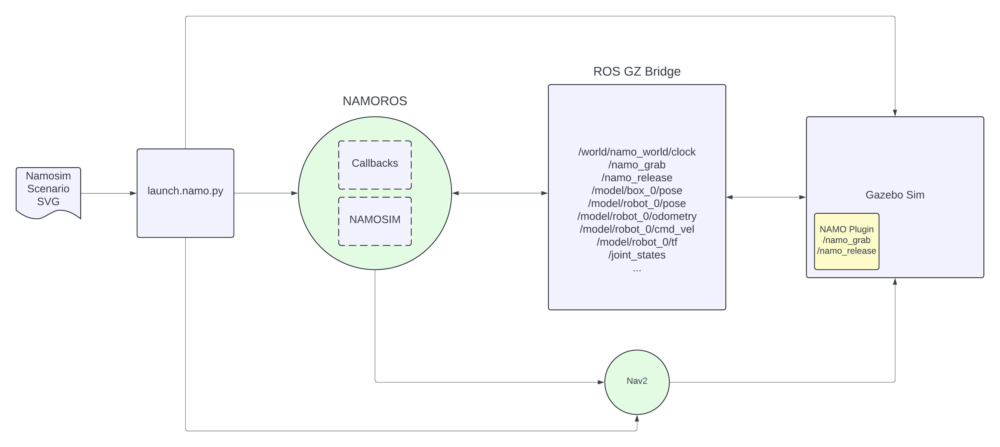
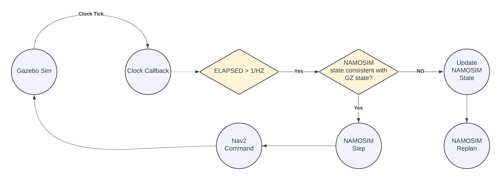

# namoros

ROS2 nodes for executing `namosim` plans on real and Gazebo-simulated robots.

## System Requirements

- Ubuntu 22.04
- ROS2 Humble

## Demo

From the root of the repo run

```bash
colcon build
source install/setup.bash
```

Then launch the demo script.

```bash
./namoros/launch_demo.sh
```

## Usage

Take a look at the demo script code for more details.

## Usage on a Real Robot

The first step to run on a real robot is to prepare the map image and yaml files and the namo-config yaml file.

## Note

The units of all namo_planner svg scenario files must be in centimeters!

## High-Level Architecture



## High-Level Internal Operation


